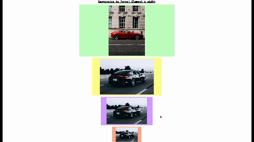

# react-touch-swiper

> Touch and drag slider component for React



- Touch friendly on mobile
- Responsive to viewport resizing
- Supports mouse drag by default
- Simple API
- Sizes to any size parent container
- small bundle size with zero dependencies

## Install

```bash
npm i react-touch-swiper
```

## Usage

```jsx
import React from 'react'
import { Slider } from 'react-touch-swiper'

// here we are importing some images
// but the Slider children should be an array of node like img
// or your own components

import images from './images'

function App() {
  return (
    <Slider
      onSlideComplete={(i) => {
        console.log('finished dragging, current slide is', i)
      }}
      onSlide={(i) => {
        console.log("sliding", i)
      }}
      onSlideStart={(i) => {
        console.log('started dragging on slide', i)
      }}
      keyEvent={false}
      controllButton={false}
      activeIndex={0}
      threshHold={100}
      transition={0.3}
      scaleEffect={true}
    >
      {images.map(({ url, title }, index) => (
        
      ))}
    </Slider>
  )
}

export default App
```

## Available Props

| Prop            | Type                             | Default | Description                                                         |
| --------------- | -------------------------------- | ------- | ------------------------------------------------------------------- |
| onSlideComplete | (completedIndex: number) => void |         | A function that gets called when sliding completed                            |
| onSlideStart    | (startIndex: number) => void     |         | A function that gets called when sliding started                                |
| onSliding       | (currentIndex: number) => void |         | A function that gets called when sliding
| activeIndex     | number                           | 0       | Set to start on this index or use state to update the current index |
| threshHold      | number                           | 100     | A pixel value that must be dragged before slide snaps to its position customise with your value according to size of the window   |
| transition      | number                           | 0.3     | The transition delay in seconds  |
| scaleEffect     | boolean                          | false   | scale effect for individual slides while dragging                    |
| keyEvent        | boolean                          | false   | Enable arrow key navigation  |
| controllButton  | boolean                          | false   | Show control buttons                  |


## License

MIT © 2023 [Hamdan-KT](https://github.com/Hamdan-KT)
